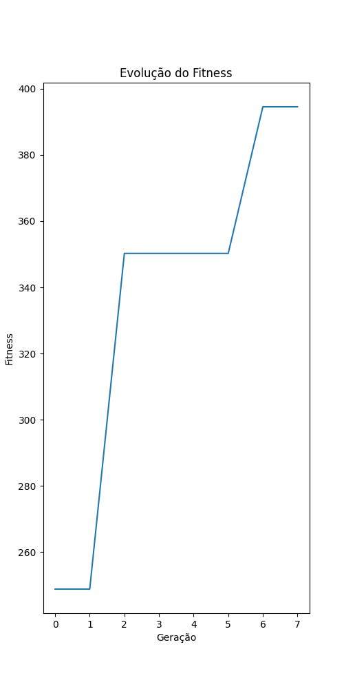

# Relatório Técnico: Programação Genética Aplicada ao Controle de Robôs Autônomos

## Objetivo Geral

Este projeto teve como objetivo analisar, entender e aprimorar um sistema de Programação Genética para controlar um robô autônomo em um ambiente 2D, repleto de obstáculos, recursos e uma meta final. O foco foi tornar o comportamento do robô mais inteligente, eficiente e adaptável, utilizando técnicas evolutivas para melhorar continuamente seu desempenho ao longo das gerações.

---

## Melhorias Implementadas

### 1. Operadores Genéticos

- **Novos operadores matemáticos**: Foram adicionadas funções como `sin`, `cos` e estruturas condicionais simples como `if_positivo` e `if_negativo`, permitindo a criação de comportamentos mais variados e adaptativos.
- **Ajuste na seleção de variáveis**: Sensores como `dist_recurso`, `angulo_recurso` e `dist_obstaculo` agora possuem maior chance de serem selecionados (20% cada), promovendo uma exploração mais focada no ambiente imediato do robô.

### 2. Sistema de Avaliação (Fitness)

Compreendemos que o modo como o robô é avaliado influencia diretamente em como ele aprende. Por isso, refinamos a função de fitness:

- **Recompensas ajustadas**:
  - A coleta de recursos passou a valer 100 pontos (antes 500), com bônus progressivo para incentivar a continuidade.
  - Atingir a meta após coletar todos os recursos agora dá um bônus de **2000 pontos**, além de recompensas adicionais por economia de energia e tempo.
- **Penalidades suavizadas**:
  - Colisões, consumo de energia e tempo parado foram penalizados de forma mais leve, evitando a inibição excessiva de comportamentos exploratórios.

### 3. Seleção e Elitismo

- **Torneio aumentado**: Ampliamos o tamanho do torneio para 5 indivíduos, promovendo uma seleção mais diversa.
- **Elitismo aplicado**: Agora, os 20% melhores indivíduos são preservados a cada geração, garantindo que boas soluções não se percam.

### 4. Controle de Estagnação

Para evitar que o algoritmo "estacione" em soluções subótimas:

- Aumentamos temporariamente a taxa de mutação em 50% após 10 gerações sem progresso.
- Substituímos 30% da população por indivíduos aleatórios, renovando a diversidade genética.

### 5. Parâmetros do Algoritmo

- **Taxa de mutação**: Definida em 30%, com aumento para 40% por nó durante estagnação.
- **Taxa de crossover**: Mantida em 80%, com redução conforme a profundidade da árvore.
- **Tamanho populacional**: Aumentado para 100 indivíduos, ampliando a capacidade exploratória do algoritmo.

---

## Resultados e Análise

### Evolução do Desempenho ao Longo das Gerações

Ao longo das execuções, observamos uma clara melhoria no desempenho dos robôs. O gráfico a seguir ilustra a evolução do valor de fitness da população:

  
*Figura 1 – Evolução do fitness: melhor indivíduo vs. média da população*

- **Melhor fitness**: O algoritmo produziu robôs com desempenho muito superior ao código original, principalmente na coleta de recursos e navegação eficiente.
- **Média da população**: Houve um crescimento constante na média, mostrando que as melhorias beneficiaram não só indivíduos excepcionais, mas toda a população evolutiva.

### Comportamento Observado

- **Coleta de recursos**: Os robôs passaram a priorizar a coleta, otimizando caminhos e evitando desperdícios de energia.
- **Navegação e colisões**: Os movimentos ficaram mais suaves, com menor incidência de colisões, demonstrando uma melhor compreensão espacial.
- **Conclusão da missão**: Os robôs passaram a concluir o percurso com mais frequência após coletar todos os recursos, cumprindo o objetivo geral de forma mais consistente.

---

## Conclusão

As mudanças aplicadas ao algoritmo genético tornaram o robô consideravelmente mais eficiente. O uso de novos operadores, ajustes na função de fitness e um controle mais refinado sobre estagnação e seleção genética contribuíram para uma evolução notável do comportamento dos indivíduos. O gráfico de evolução do fitness confirma esse progresso, destacando a melhoria tanto no melhor desempenho quanto na média geral da população.

---

## Colaboradores

- **Carlos Breno Johnson**  
  GitHub: [@BrenoJhonson](https://github.com/BrenoJhonson)

- **Lucas Felipe de Souza**  
  GitHub: [@LucasFSouza552](https://github.com/LucasFSouza552)

- **João Antônio de Souza Neto**  
  GitHub: [@JoaoASouzaN](https://github.com/JoaoASouzaN)

---

## Repositório

Todo o código-fonte, resultados e gráficos estão disponíveis no repositório:  
🔗 [Link para o Repositório](https://github.com/BrenoJhonson/Progressao-Genetica.git)
